# 总结

## 一：数据结构篇

### 线性表：

线性表是一种线性结构，它是由零个或多个数据元素构成的**有限序列**。线性表的特征是在一个序列中，除了头尾元素，每个元素都有且只有一个直接前驱，有且只有一个直接后继，而序列头元素没有直接前驱，序列尾元素没有直接后继。

数据结构中常见的线性结构有数组、单链表、双链表、循环链表等。线性表中的元素为某种**相同**的抽象数据类型。可以是C语言的内置类型或结构体，也可以是C++自定义类型。

### 数组

数组在实际的物理内存上也是连续存储的，数组有**上界**和**下界**。C语言中定义一个数组：
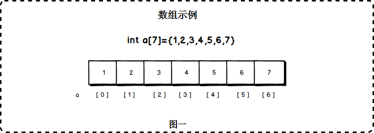

数组下标是从0开始的，a[0]对应第一个元素。其中，a[0]称为数组a的下界，a[6]称为数组a的上届。超过这个范围的下标使用数组，将造成**数组越界错误**。
数组的特点是：**数据连续，支持快速随机访问。**
数组分为固定数组与动态数组。其中固定数组的大小必须在编译时就能够确认，动态数组允许在运行时申请数组内存。复杂点的数组是多维数组，多维数组实际上也是通过一维数组来实现的。

### 单向链表

单向链表是链表的一种。链表由节点所构成，节点内含一个指向下一个节点的指针，节点依次链接成为链表。因此，链表这种数据结构通常在物理内存上是不连续的。链表的通常含有一个头节点，头节点不存放实际的值，它含有一个指针，指向存放元素的第一个节点。

```java
class Node():    
 单链表中的节点应该具有两个属性：val 和 next。    val 是当前节点的值，    next 是指向下一个节点的指针/引用。     `

` def __init__(self, value):   # 存放元素数据  self.val = value   # next是下一个节点的标识  self.next = None`
```


#### 设计链表的实现

您可以选择使用单链表或双链表。单链表中的节点应该具有两个属性：`val` 和 `next`。`val` 是当前节点的值，`next` 是指向下一个节点的指针/引用。如果要使用双向链表，则还需要一个属性 `prev` 以指示链表中的上一个节点。假设链表中的所有节点都是 0-index 的。

在链表类中实现这些功能：

- get(index)：获取链表中第 `index` 个节点的值。如果索引无效，则返回`-1`。

- addAtHead(val)：在链表的第一个元素之前添加一个值为 `val` 的节点。插入后，新节点将成为链表的第一个节点。

- addAtTail(val)：将值为 `val` 的节点追加到链表的最后一个元素。

- addAtIndex(index,val)：在链表中的第 `index` 个节点之前添加值为 `val` 的节点。如果 `index` 等于链表的长度，则该节点将附加到链表的末尾。如果 `index` 大于链表长度，则不会插入节点。

- deleteAtIndex(index)：如果索引 `index` 有效，则删除链表中的第 `index` 个节点

  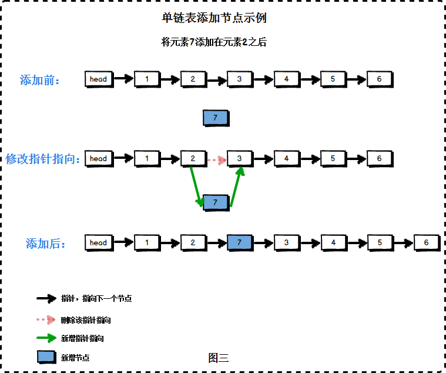

  

#### 链表与顺序表的对比

链表失去了顺序表随机读取的优点，同时链表由于增加了结点的指针域，空间开销比较大，但对存储空间的使用要相对灵活。

链表与顺序表的各种操作复杂度如下所示：

| 操作            | 链表 | 顺序表 |
| --------------- | ---- | ------ |
| 访问元素        | O(n) | O(1)   |
| 在头部插入/删除 | O(1) | O(n)   |
| 在尾部插入/删除 | O(n) | O(1)   |
| 在中间插入/删除 | O(n) | O(n)   |


## 二：算法篇

## 三：java代码篇

### 一：Java8

#### lamada

##### 什么是lamada表达式？

Lambda表达式可以认为是对匿名内部类的一种简化，但不是所有的匿名内部类都可以简化为Lambda表达式。只有**函数式接口的匿名内部类**才可以使用Lambda表达式来进行简化。函数式接口不同于普通接口，较为特殊化。接口当中只有一个抽象方法是需要我们去实现的，Lambda表达式正好是针对这个唯一的抽象方法使用。

##### 语法格式：

参数列表 箭头 方法体  总结：(参数列表)->{方法体} 

- 参数类型可以省略。 但是有多个参数的情况下，不能只省略一个
-  如果参数有且仅有一 个，那么小括号可以省略
-  如果代码块的语句只有一 条，可以省略大括号和分号，甚至是return

##### 总结：

- Lamada表达式可以理解为一种匿名函数：他没有名称，但有参数列表、函数主体、返回类型，可能还会有一个可以抛出的异常列表。
- Lamada表达式可以让你的代码更加简洁的传递代码。
- 函数式接口就是仅仅声明了一个抽象方法的接口。
- 只有在接受函数式接口的地方才可以使用Lamada表达式。
- Lamada表达式允许你直接内联，为函数式接口的抽象方法提供实现，并且将整个表达式作为函数式接口的一个实例。
- Java8自带一些常用的函数式接口、放在java.util.function包里,包括Predicate<T>、Function<T、R>、Supplier<T>、Consumer<T>、&&BinaryOperator<T>。
- 为了避免装箱操作，对Predicate<T>、Function<T、R>等通用的函数式接口的原始类型特化：IntPredicate、IntToLongFuncation等。
- 环绕执行模式（即在方法所必须的代码中间，你需要执行点什么操作，比如分配资源和清理）可以配合Lamada提高灵活性和可重要性。
- Lamada表达式所需要代表的类型称为目标类型。
- 方法引用让你重复使用现有的方法实现并传递他们。
- Comparator、Predicate 和Funcation等函数式接口都有几个可以用来结合lamada表达式的默认方法。

#### 流（Stream）

流是一系列数据项，一次只生成一项。程序可以从输入流中一个一个读取数据项，然后以同样的方式将数据项写入输出流。一个程序的输出流很可能是另一个程序的输入流。思路变成了把这样的流变成那样的流（就像写数据库查询语句时的那种思路），而不是一次只处理一个项目。另一个好处是，Java 8可以透明地把输入的不相关部分拿到几个CPU内核上去分别执行你的 Stream操作流水线——这是几乎免费的并行，用不着去费劲搞Thread了。

#### 操作

+ filter——接受Lambda，从流中排除某些元素。在本例中，通过传递lambda d -> d.getCalories() > 300，选择出热量超过300卡路里的菜肴。
+ map——接受一个Lambda，将元素转换成其他形式或提取信息。在本例中，通过传递方法引用Dish::getName，相当于Lambda d -> d.getName()，提取了每道菜的菜名。
+ limit——截断流，使其元素不超过给定数量。

collect——将流转换为其他形式。在本例中，流被转换为一个列表。它看起来有点儿像变魔术，我们在第6章中会详细解释collect的工作原理。现在，你可以把collect看作能够接受各种方案作为参数，并将流中的元素累积成为一个汇总结果的操作。这里的toList()就是将流转换为列表的方案。

+  一个数据源（如集合）来执行一个查询；
+  一个中间操作链，形成一条流的流水线；
+  一个终端操作，执行流水线，并能生成结果。

##### 中间操作


##### 终端操作

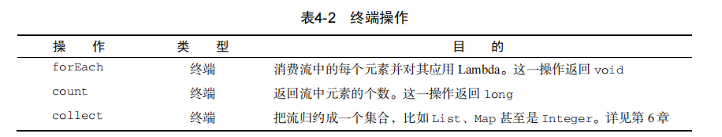

##### 用谓词筛选

Streams接口支持filter方法。该操作会接受一个谓词（一个返回boolean的函数）作为参数，并返回一个包括所有符合谓词的元素的流。

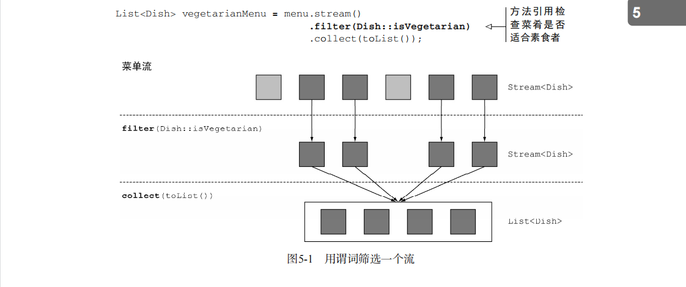

##### 筛选和切片

###### 筛选各异的元素

流还支持一个叫作distinct的方法，它会返回一个元素各异（根据流所生成元素的hashCode和equals方法实现）的流。

```java
List<Integer> numbers = Arrays.asList(1, 2, 1, 3, 3, 2, 4); 
numbers.stream()  .filter(i -> i % 2 == 0) .distinct().forEach(System.out::println);
```


###### 截短流

流支持limit(n)方法，该方法会返回一个不超过给定长度的流。所需的长度作为参数传递给limit。如果流是有序的，则最多会返回前n个元素。(请注意limit也可以用在无序流上，比如源是一个Set。这种情况下，limit的结果不会以任何顺序排列。)

```java
List<Dish> dishes = menu.stream() 
 .filter(d -> d.getCalories() > 300) 
 .limit(3) 
 .collect(toList());
```

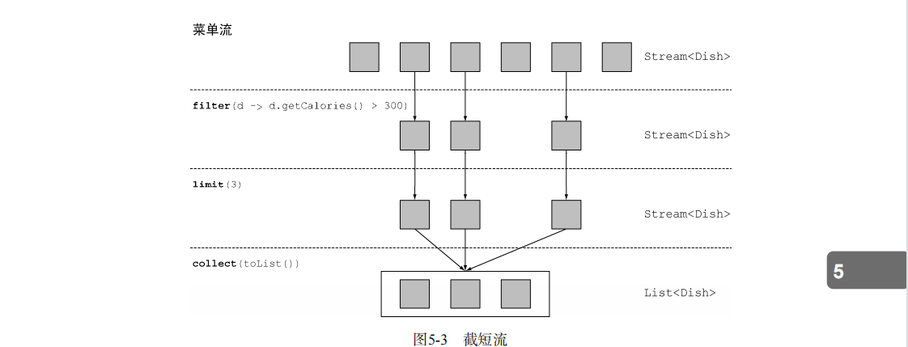

###### 跳过元素

流还支持skip(n)方法，返回一个扔掉了前n个元素的流。如果流中元素不足n个，则返回一个空流。请注意，limit(n)和skip(n)是互补的！

```java
List<Dish> dishes = menu.stream() 
 .filter(d -> d.getCalories() > 300) 
 .skip(2) 
 .collect(toList());
```


##### 映射

###### 对流中每一个元素应用函数

流支持map方法，它会接受一个函数作为参数。这个函数会被应用到每个元素上，并将其映射成一个新的元素（使用映射一词，是因为它和转换类似，但其中的细微差别在于它是“创建一个新版本”而不是去“修改”）。

```java
List<String> dishNames = menu.stream() 
 .map(Dish::getName) 
 .collect(toList());
```

eg：现在让我们回到提取菜名的例子。如果你要找出每道菜的名称有多长，怎么做？你可以像下面这样，再链接上一个map。

```java
List<Integer> dishNameLengths = menu.stream() 
 .map(Dish::getName) 
 .map(String::length) 
 .collect(toList());
```

###### 流的扁平化

使用flatMap方法的效果是，各个数组并不是分别映射成一个流，而是映射成流的内容。所有使用map(Arrays::stream)时生成的单个流都被合并起来，即扁平化为一个流。

```java
List<String> uniqueCharacters = words.stream() 
 .map(w -> w.split("")) 
 .flatMap(Arrays::stream) 
 .distinct() 
 .collect(Collectors.toList());
```


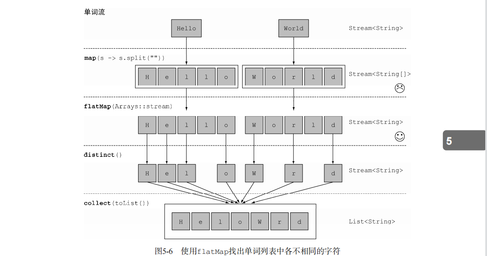

一言以蔽之，flatmap方法让你把一个流中的每个值都换成另一个流，然后把所有的流连接起来成为一个流。

###### 测验 映射

```java
(1) 给定一个数字列表，如何返回一个由每个数的平方构成的列表呢？例如，给定[1, 2, 3, 4, 5]，应该返回[1, 4, 9, 16, 25]。

答案：你可以利用map方法的Lambda，接受一个数字，并返回该数字平方的Lambda来解决这个问题。

List<Integer> numbers = Arrays.asList(1, 2, 3, 4, 5); 

List<Integer> squares = numbers.stream() .map(n -> n \* n) .collect(toList()); 

(2) 给定两个数字列表，如何返回所有的数对呢？例如，给定列表[1, 2, 3]和列表[3, 4]，应
该返回[(1, 3), (1, 4), (2, 3), (2, 4), (3, 3), (3, 4)]。为简单起见，你可以用有两个元素的数组来代表数对。 

答案：你可以使用两个map来迭代这两个列表，并生成数对。但这样会返回一个Stream- <Stream<Integer[]>>。你需要让生成的流扁平化，以得到一个Stream<Integer[]>。这正是flatMap所做的：

List<Integer> numbers1 = Arrays.asList(1, 2, 3); 

List<Integer> numbers2 = Arrays.asList(3, 4); 

List<int[]> pairs = numbers1.stream() .flatMap(i -> numbers2.stream().map(j -> new int[]{i, j})).collect(toList()); 

(3) 如何扩展前一个例子，只返回总和能被3整除的数对呢？例如(2, 4)和(3, 3)是可以的。

答案：你在前面看到了，filter可以配合谓词使用来筛选流中的元素。因为在flatMap操作后，你有了一个代表数对的int[]流，所以你只需要一个谓词来检查总和是否能被3整除就可以了：

List<Integer> numbers1 = Arrays.asList(1, 2, 3); 

List<Integer> numbers2 = Arrays.asList(3, 4); 

List<int[]> pairs =  numbers1.stream() 

 .flatMap(i -> numbers2.stream() 

 .filter(j -> (i + j) % 3 == 0) 

 .map(j -> new int[]{i, j}) 

 ) 
 .collect(toList()); 

其结果是[(2, 4), (3, 3)]。

```

##### 查找和匹配

另一个常见的数据处理套路是看看数据集中的某些元素是否匹配一个给定的属性。Stream API通过allMatch、anyMatch、noneMatch、findFirst和findAny方法提供了这样的工具。

###### 检查谓词是否至少匹配一个元素

anyMatch方法可以回答“流中是否有一个元素能匹配给定的谓词”。比如，你可以用它来看看菜单里面是否有素食可选择：

```java
if(menu.stream().anyMatch(Dish::isVegetarian)){ 
 System.out.println("The menu is (somewhat) vegetarian friendly!!"); 
} 
```

anyMatch方法返回一个boolean，因此是一个终端操作。

###### 检查谓词是否匹配所有元素

allMatch方法的工作原理和anyMatch类似，但它会看看流中的元素是否都能匹配给定的谓词

```java
boolean isHealthy = menu.stream() .allMatch(d -> d.getCalories() < 1000);
```

###### noneMatch

和allMatch相对的是noneMatch。它可以确保流中没有任何元素与给定的谓词匹配

```java
boolean isHealthy = menu.stream() .noneMatch(d -> d.getCalories() >= 1000);
```

anyMatch、allMatch和noneMatch这三个操作都用到了我们所谓的短路，这就是大家熟悉的Java中&&和||运算符短路在流中的版本

##### 短路求值

有些操作不需要处理整个流就能得到结果。例如，假设你需要对一个用and连起来的大布尔表达式求值。不管表达式有多长，你只需找到一个表达式为false，就可以推断整个表达式将返回false，所以用不着计算整个表达式。这就是**短路**。对于流而言，某些操作（例如allMatch、anyMatch、noneMatch、findFirst和findAny）不用处理整个流就能得到结果。只要找到一个元素，就可以有结果了。同样，limit也是一个短路操作：它只需要创建一个给定大小的流，而用不着处理流中所有的元素。在碰到无限大小的流的时候，这种操作就有用了：它们可以把无限流变成有限流。

###### 查找元素

findAny方法将返回当前流中的任意元素。它可以与其他流操作结合使用。

```java
Optional<Dish> dish =  menu.stream() .filter(Dish::isVegetarian) .findAny(); 
```

流水线将在后台进行优化使其只需走一遍，并在利用短路找到结果时立即结束

###### 查找第一个元素

有些流有一个出现顺序（encounter order）来指定流中项目出现的逻辑顺序（比如由List或排序好的数据列生成的流）。对于这种流，你可能想要找到第一个元素。为此有一个findFirst方法，它的工作方式类似于findany。

```java
List<Integer> someNumbers = Arrays.asList(1, 2, 3, 4, 5); 
Optional<Integer> firstSquareDivisibleByThree = someNumbers.stream() .map(x -> x * x) 
 .filter(x -> x % 3 == 0) 
 .findFirst(); // 9
```

###### 何时使用**findFirst**和**findAny**?

你可能会想，为什么会同时有findFirst和findAny呢？答案是并行。找到第一个元素在并行上限制更多。如果你不关心返回的元素是哪个，请使用findAny，因为它在使用并行流时限制较少。

##### 归约

###### 元素求和

```java
int sum = numbers.stream().reduce(0, (a, b) -> a + b); 
```

无初始值 reduce还有一个重载的变体，它不接受初始值，但是会返回一个Optional对象：

```java
Optional<Integer> sum = numbers.stream().reduce((a, b) -> (a + b));
```

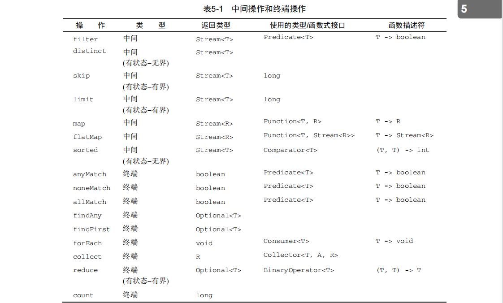

##### 数值流

###### 原始类型流特化

Java 8引入了三个原始类型特化流接口来解决这个问题：IntStream、DoubleStream和 LongStream，分别将流中的元素特化为int、long和double，从而避免了暗含的装箱成本。每 个接口都带来了进行常用数值归约的新方法，比如对数值流求和的sum，找到最大元素的max。 此外还有在必要时再把它们转换回对象流的方法。要记住的是，这些特化的原因并不在于流的复杂性，而是装箱造成的复杂性——即类似int和Integer之间的效率差异。

映射到数值流

将流转换为特化版本的常用方法是mapToInt、mapToDouble和mapToLong。这些方法和前 面说的map方法的工作方式一样，只是它们返回的是一个特化流，而不是Stream。

```java
int calories = menu.stream() .mapToInt(Dish::getCalories) .sum();
```

##### flatMap

使用flatMap方法的效果是，各个数组并不是分别映射成一个流，而是映射成流的内容


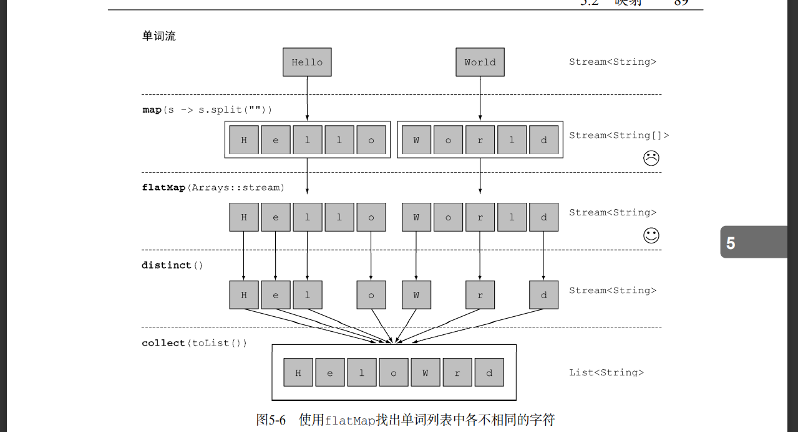

例如：给定两个数字列表，如何返回所有的数对呢？例如，给定列表[1, 2, 3]和列表[3, 4]，应 该返回[(1, 3), (1, 4), (2, 3), (2, 4), (3, 3), (3, 4)]。为简单起见，你可以用有两个元素的数组来代 表数对。

答：使用两个map来迭代这两个列表，并生成数对。但这样会返回一个Stream- <Stream<Integer[]>>。你需要让生成的流扁平化，以得到一个Stream<Integer[]>。这正是flatMap所做的： 

```java
List<Integer> numbers1 = Arrays.asList(1, 2, 3); 
List<Integer> numbers2 = Arrays.asList(3, 4); 
List<int[]> pairs = 
 numbers1.stream() 
 .flatMap(i -> numbers2.stream() 
 .map(j -> new int[]{i, j}))
 .collect(toList()); 
```

#### 小结

+  流是“从支持数据处理操作的源生成的一系列元素”。
+  流利用内部迭代：迭代通过filter、map、sorted等操作被抽象掉了。
+  流操作有两类：**中间操作**和**终端操作**。
+  filter和map等中间操作会返回一个流，并可以链接在一起。可以用它们来设置一条流水线，但并不会生成任何结果。
+  forEach和count等终端操作会返回一个非流的值，并处理流水线以返回结果。
+  流中的元素是按需计算的。

### 二：杂记

#### 注解篇

##### @NotNull&&@NotBlank&&@NotEmpty

- @**NotNull**适用于基本数据类型(**Integer**，**Long**，**Double**等等)，当 @NotNull 注解被使用在 String 类型的数据上，则表示该数据不能为 Null（但是可以为 Empty）
- @**NotBlank**适用于 **String** 类型的数据上，加了@NotBlank 注解的参数不能为 Null 且 **trim()** 之后 **size > 0**
- @**NotEmpty**适用于 String、**Collection**集合、Map、数组等等，加了@NotEmpty 注解的参数不能为 Null 或者 长度为 0

#### 事务

##### 四个特性

1. 原子性：即操作这些指令时（如更新、插入、删除等），要么全部执行成功，要么全部不执行，只要其中一个指令执行失败，所有的指令都执行失败，数据进行回滚，回到执行指令之前的数据状态。
2. 一致性：事务的执行使数据从一个状态转换为另一个状态，但是对于整个数据的完整性保持稳定。
3.  隔离性：在该事务执行的过程中，无论发生的任何数据的改变都应该只存在于该事务之中，对外界不存在任何影响。只有在事务确定正确提交之后，才会显示该事务对数据的改变。其他事务才能获取到这些改变后的数据。
4.  持久性：当事务正确完成后，它对于数据的改变是永久性的。

##### 事务失效

- 方法没有被public修饰
- 类没有被Spring托管
- 不正确的异常捕获（如果事务方法抛出异常被 catch 处理了，导致 @Transactional 无法回滚而导致事务失效）
- 同一类中方法调用（如果同一个类中的两个方法分别为A和B，方法A上没有添加事务注解，方法B上添加了 @Transactional事务注解，方法A调用方法B，那么，方法B的事务会失效）
- propagation事务传播行为配置错误（如果内部方法的事务传播类型为不支持事务的传播类型）
- rollbackFor参数设置错误（@Transactional注解中rollbackFor参数标注了错误的异常类型，那么，Spring事务的回滚就无法识别，导致事务回滚失效）
- 没有配置事务管理器
- 数据库本身不支持事务（Spring事务生效的前提是所连接的数据库要支持事务，如果底层的数据库都不支持事务，那么，Spring的事务肯定会失效。例如，如果使用的数据库为MySQL，并且选用了MyISAM存储引擎，则Spring的事务就会失效。）
- 放方法被final修饰时，也会导致事务失效。
- 直接调用 内部方法
- 多线程调用
- 如果抛的异常不正确，事务也不会回滚（因为Spring事务，默认情况下只会回滚RuntimeException（运行时异常）和Error（错误），对于普通的非运行时异常，它不会回滚。）

注：spring事务也是通过动态代理来实现的,在对一个bean进行初始化的过程中，在执行到第八个后置处理器方法，org.springframework.aop.framework.autoproxy.AbstractAutoProxyCreator#postProcessAfterInitialization在AbstractFallbackTransactionAttributeSource类的computeTransactionAttribute方法中有个判断，如果目标方法不是public，则TransactionAttribute返回null，即不支持事务。

```java
// Don't allow no-public methods as required.
if (allowPublicMethodsOnly() && !Modifier.isPublic(method.getModifiers())) {
  return null;
}
```


## 四：Git篇

### Git 操作

- git init   初始化；

- git branch git查看分支**名称**；

- git remote add origin git 远程代码仓库地址 ， 与远程git代码仓库建立**连接**，

- git fetch origin 分支名称 （更新分支最新状态）**切换分支拉取代码** ；

- git checkout -b 分支名称 默认拉取的分支为master主分支，需要用命令来对**分支进行切换**；

- git pull origin 分支名称；**拉取**代码与线下的git代码合并；

-  git push -u origin dev-2.0.1 最后合并完后将代码**push**到git上；

- **生成SSH** ssh-keygen -t rsa -C '402542336@qq.com' -f ~/.ssh/gitee_id_rsa；

- git config credential.helper store 执行完 第一次要输入账号密码，以后就不用了。不加参数： --**global** 只对这个仓库生效，并非全局设置 。

## 五:  Linux

### 常用命令

- ifconfig -a  **查看ip地址**
- tar  -zxvf  jdk-8u311-linux-i586.tar.gz  ***#对压缩包解压***
- tail -f app.log　　动态查看日志(默认最后10行，相当于增加参数 -n 10)。
-  tail -200f app.log (最后200行，某一时刻往前推)  ； tail -n 20 app.log(显示app.log**最后20**行)tail -n +5 app.log　　(从**第5行**开始显示文件)
- cat -n filename |grep "**关键字**"
- cat app.log | grep -C 5 '关键字' 　　(显示日志里匹配字串那行以及**前后5行**)；cat app.log | grep -B 5 '关键字' (显示匹配字串及**前5行**)；cat app.log | grep -A 5 '关键字' 　　(显示匹配字串及**后5行**)


### 安装mysql

wget -i -c http://dev.mysql.com/get/mysql57-community-release-el7-10.noarch.rpm 下载mysql包

安装mysql包

```sql
yum -y install mysql57-community-release-el7-10.noarch.rpm 
```

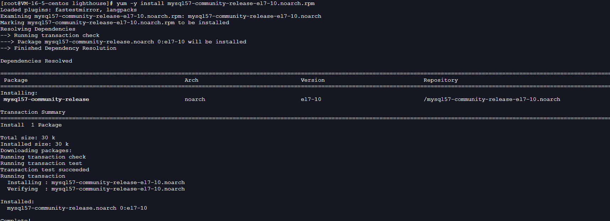

```
yum -y install mysql-community-server 安装mysql 
```

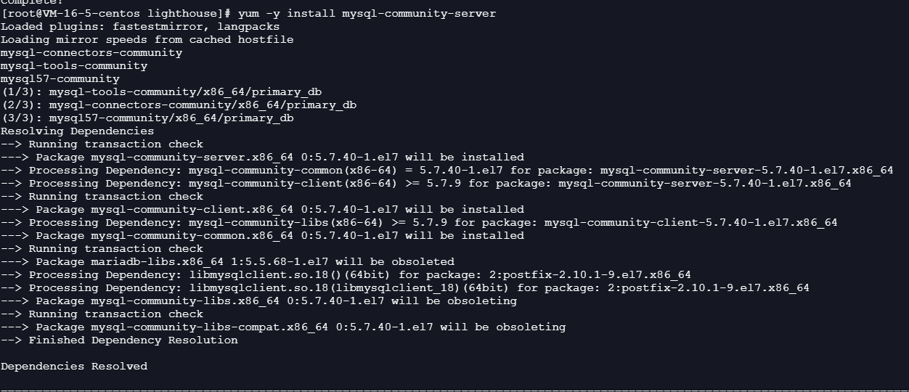

遇见的错误

```
*yum -y install mysql-community-server --nogpgcheck*  需要禁掉GPG验证检查
```

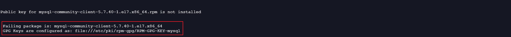

```sql
service mysqld status查看mysql运行状态
```

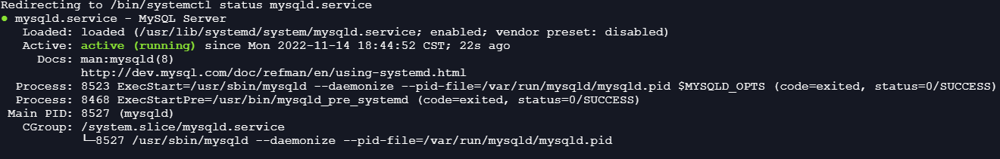

```sql
grep ‘password’ /var/log/mysqld.log 查看mysql密码
```

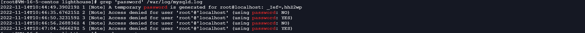

```sql
mysql -u root -p 进入mysql
```

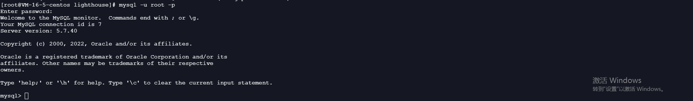

```js
stop mysqld.service 关闭服务
```

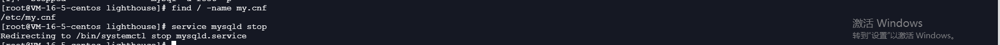

```js
vim /etc/my.cnf
```

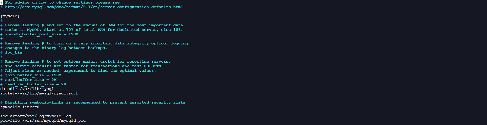

```js
输入i  加入skip-grant-tables  然后esc  ：wq保存退出
```

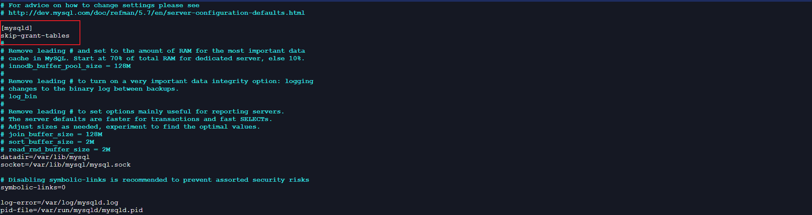

```
service mysqld start 重启mysql 服务
```

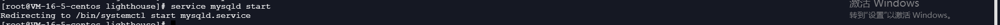

```sql
show databases；
```

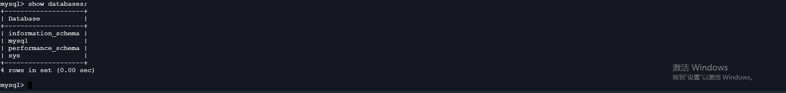

3.安装jdk

```sql
yum install -y java-1.8.0-openjdk.x86_64 下载jdk 
```

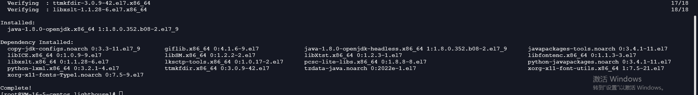

```sql
java -version  查看版本
```

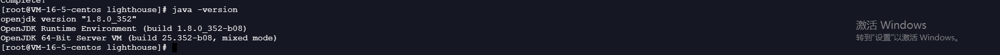

### 安装nacos

下载nacos

```sql
[wget](https://so.csdn.net/so/search?q=wget&spm=1001.2101.3001.7020) https://github.com/alibaba/nacos/releases/download/1.2.0/nacos-server-1.2.0.tar.gz
```

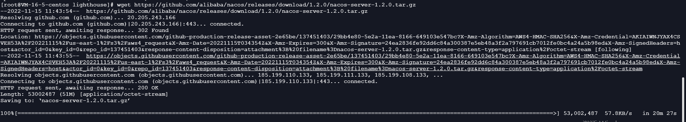

tar -xvf nacos-server-1.2.0.tar.gz 解压nacos

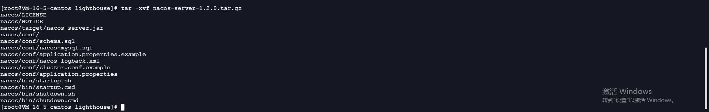

**启动命令**

```mssql
sh startup.sh -m standalone
```

### 安装docker

安装一组工具

```
sudo yum install -y yum-utils 
```

设置 yum 仓库地址

```
sudo yum-config-manager \
    --add-repo \
    https://download.docker.com/linux/centos/docker-ce.repo
sudo yum-config-manager \
     --add-repo \
     http://mirrors.aliyun.com/docker-ce/linux/centos/docker-ce.repo
```

更新 yum 缓存

```
sudo yum makecache fast #yum 是包管理器
```

安装新版 docker

```
sudo yum install -y docker-ce docker-ce-cli containerd.io
```

 启动docker

```
 systemctl start docker
```

 查看状态

```
systemctl status docker
```

启动

```
# 设置开机自启
systemctl enable docker
# 禁用开机自启
systemctl disable docker
# 重启
systemctl restart docker
```

#### docker操作

```shell
1.语法：docker pull 镜像名
拉取docker镜像
docker pull hello-world

2.浏览镜像文件
语法：docker images

3.查看镜像详情
语法：docker inspect 镜像名或镜像id
EG:docker inspect hello-world

4.导出镜像文件
镜像导出(linux系统中的镜像文件下载到本地-例如window)，导出后给他人使用
语法：docker save hello-world | gzip >（这里填写要导出的镜像名）.tar.gz
EG:docker save  hello-world | gzip > hello-world.tar.gz

5.删除镜像文件
语法：docker image rm 镜像名或镜像id
EG:docker image rm hello-world

6.导入镜像操作
镜像导入（要在hello-world.tar.gz 文件所在目录下执行这个命令）*注意*这里的hello-world.tar.gz 文件是我们要导入的镜像，这里以hello-world.tar.gz 文件为例。
EG:docker load < hello-world.tar.gz  

7.运行镜像文件
基于镜像，启动容器运行。
语法：docker run 镜像名
EG:docker run hello-world

8.查看Docker中的容器
docker ps

9.查看docker运行中的所有容器
docker ps -a

10.查看容器日志(logs)信息
docker container logs 802  #802为自己的容器id（一般写前三位即可）

11.停止(stop)或重启(Restart)容器(Container)
docker container stop 802  #802为容器自己的id
docker container restart 802 #802位容器自己的id

12.进入(exec)指定容器(Container)
docker exec -it 802 bash #802为容器id

13.从容器(Container)中退出(exit)
exit

14.删除(rm)容器(Container)
docker container rm 802 #802为容器id
docker container rm -f 802 #802为容器id(强制删除)

15.清理所有处于终止状态容器
docker container prune
```

#### docker 换源地址

```javascript
CSDN：https://blog.csdn.net/just_for_that_moment/article/details/125308103

sudo mkdir -p /etc/docker
sudo tee /etc/docker/daemon.json <<-'EOF'
{
  "registry-mirrors": ["https://yxzrazem.mirror.aliyuncs.com"]
}
EOF
sudo systemctl daemon-reload
sudo systemctl restart docker
```

### 安装redis

```js
#拉取redis
docker pull redis

#myredis是启动之后的docker容器名称
docker run --name myredis -d redis

#创建目录存放redis.conf文件
mkdir /opt/docker_redis
cd /opt/docker_redis

#下载redis.conf文件
wget http://download.redis.io/redis-stable/redis.conf

#文件授权
chmod 777 redis.conf

#修改默认配置信息
vi /opt/docker_redis/redis.conf

bind 127.0.0.1 #通过#注释掉，解除本地连接限制
protected-mode yes #默认no，保护模式，限制为本地访问，修改后解除保护模式
daemonize yes #默认no 为不守护进程模式，修改为yes
requirepass 1008 #设置密码（建议设置，不设置有风险）
appendonly yes  #持久化(可选)

#docker启动redis命令
docker run -p 6379:6379 --name redis -v /docker-software/redis/redis.conf:/etc/redis/redis.conf  -v /docker-software/redis/data:/data -d redis redis-server /etc/redis/redis.conf --appendonly yes

#命令分析
-p 6379:6379 端口映射：前表示主机部分，：后表示容器部分。
–name redis 指定该容器名称，查看和进行操作都比较方便。
-v 挂载文件或目录 ：前表示主机部分，：后表示容器部分。
-d redis 表示后台启动redis
redis-server /etc/redis/redis.conf以配置文件启动redis，加载容器内的conf文件，最终找到的是挂载的目录/usr/local/docker/redis.conf
–appendonly yes 开启redis 持久化
–requirepass 1008 设置密码为1008

```

进入redis命令

```shell
docker exec -it redis redis-cli
```

### 安装mq

```shell
docker pull rabbitmq
```


```shell
创建&启动
docker run -id --hostname myrabbit --name rabbitmq1 -p 15672:15672 -p 5672:5672 rabbitmq

进入容器
docker exec -it rabbitmq1 /bin/bash

下载插件
abbitmq-plugins enable rabbitmq_management
```


### 防火墙

```shell
# 关闭防火墙
systemctl stop firewalld
# 关闭防火墙  
service iptables stop
# 启动防火墙
systemctl start firewalld
# 禁止开机启动防火墙
systemctl disable firewalld 
# 设置开机启用防火墙
systemctl enable firewalld.service
#查看是否关闭防火墙
systemctl status firewalld
```

## 六：mysql

### sql语句

#### 修改字段名

```js
# mysql修改字段名：
ALTER  TABLE 表名 CHANGE [column] 旧字段名 新字段名 新数据类型; 
```

#### 修改表名

```js
# 在mysql中可以使用【alter table 旧表名 rename 新表名;】语句修改表名，如
【mysql> alter table user rename user2;】
```

#### 修改某一列的类型

```js
# alter table 表名 modify 列名 类型;
mysql> alter table type modify type_name varchar(100) default null comment '';
```

#### 增加一列

```powershell
# alter table 表名 add 列名 类型;
mysql> alter table type add age int(11) default null comment '';
```

#### 删除一列

```powershell
# 用法：alter table type drop 列名;
mysql> alter table type drop age default null comment '';
```

#### 索引

```mysql
-- 创建一个普通索引（方式①）
create index 索引名 ON 表名 (列名(索引键长度) [ASC|DESC]);
-- 创建一个普通索引（方式②）
alter table 表名 add index 索引名(列名(索引键长度) [ASC|DESC]);
-- 创建一个普通索引（方式③）
CREATE TABLE tableName(  
  columnName1 INT(8) NOT NULL,   
  columnName2 ....,
  .....,
  index [索引名称] (列名(长度))  
);
-- 后续其他类型的索引都可以通过这三种方式创建

-- 创建一个唯一索引
create unique 索引名 ON 表名 (列名(索引键长度) [ASC|DESC]);

-- 创建一个主键索引
alter table 表名 add primary key 索引名(列名);

-- 创建一个全文索引
create fulltext index 索引名 ON 表名(列名);

-- 创建一个前缀索引
create index 索引名 ON 表名 (列名(索引键长度));

-- 创建一个空间索引
alter table 表名 add spatial key 索引名(列名);

-- 创建一个联合索引
create index 索引名 ON 表名 (列名1(索引键长度),列名2,...列名n);
```

### 连接join

sql的left join 、right join 、inner join之间的区别

- left join(左联接) 返回包括左表中的所有记录和右表中联结字段相等的记录 
- right join(右联接) 返回包括右表中的所有记录和左表中联结字段相等的记录
- inner join(等值连接) 只返回两个表中联结字段相等的行

### 分组&&过滤

```mysql
-- 基于字段进行分组
select * from 表名 group by 字段1,字段2....;

-- 基于分组查询后的结果做条件过滤
select * from 表名 group by 字段1 having 条件;
```

group by、having 这些语句，更多的要配合一些聚合函数使用，如min()、max()、count()、sum()、avg()....，这样才能更符合业务需求，但对于聚合函数后面再介绍，先简单说说where、having的区别：这两个关键字都是用来做条件过滤的，但where优先级会比group by高，因此当分组后需要再做条件过滤时，就无法使用where做筛选，而having用来对分组后的结果做条件过滤的。查询语句中的各类关键字执行优先级为：from → where → select → group by → having → order by。

```sql
-- 基于一条SQL语句的查询结果进一步做查询
select * from (select * from 表名 where 条件) as 别名 where 条件;

-- 将一条SQL语句的查询结果作为条件继续查询（只适用于子查询返回单值的情况）
select * from 表名 where 字段名 = (select 字段名 from 表名 where 条件);

-- 将一条SQL语句的查询结果作为条件继续查询（适用于子查询返回多值的情况）
select * from 表名 where 字段名 exists (select 字段名 from 表名 where 条件);
-- 上述的exists可以换为not exists，表示查询不包含相应条件的数据

-- 将一条SQL语句的多个查询结果，作为条件与多个字段进行范围查询
select * from 表名 where (字段1,字段2...) in (select 字段1,字段2... from 表名);
```

exists的作用和in大致相同，只不过not in时会触发全表扫描，而not exists依旧可以走索引查询，因此通常情况下尽量使用not exists代替not in来查询数据。

### 关联查询

- 交叉连接
- 内连接
- 外连接：
  - 左连接
  - 右连接
  - 全连接

```mysql
-- 交叉连接：默认把前一张表的每一行数据与后一张表的所有数据做关联查询
select * from 表1,表2...; -- 这种方式默认采用交叉连接的方式
select * from 表1 cross join 表2; -- 显式声明采用交叉连接的方式

-- 内连接：只返回两张表条件都匹配的数据
-- 隐式的内连接写法
select * from 表1,表2... where 表1.字段 = 表2.字段 ...; 
-- 等值内连接
select * from 表1 别名1 inner join 表2 别名2 on 别名1.字段 = 别名2.字段;
-- 不等式内连接
select * from 表1 别名1 inner join 表2 别名2 on 别名1.字段 < 别名2.字段;

-- 左外连接：左表为主，右表为次，无论左表在右表是否匹配，都返回左表数据，缺失的右表数据显示NULL
select * from 表1 left join 表2 on 表1.字段 = 表2.字段;

-- 右外连接：和左连接相反，右表为主，左表为次，永远返回右表的所有数据
select * from 表1 right join 表2 on 表1.字段 = 表2.字段;

-- 全外连接：两张表没有主次之分，每次查询都会返回两张表的所有数据，不匹配的显示NULL
-- MySQL中不支持全连接语法，只能通过union all语句，将左、右连接查询拼接起来实现
select * from 表1 left join 表2 on 表1.字段 = 表2.字段
union all
select * from 表1 right join 表2 on 表1.字段 = 表2.字段;

-- 继续拼接查询两张以上的表
select * from 表1 left join 表2 on 表1.字段 = 表2.字段 left join 表3 on 表2.字段 = 表3.字段;
-- 通过隐式连接的方式，查询两张以上的表
select * from 表1,表2,表3... where 表1.字段 = 表2.字段 and 表1.字段 = 表3.字段...;
-- 通过子查询的方式，查询两张以上的表
select * from 
(表1 as 别名1 left join 表2 as 别名2 on 别名1.字段 = 别名2.字段) 
left join 
表3 as 别名3 on 别名1.字段 = 别名3.字段;

```

多表联查时的笛卡尔积问题，所谓的笛卡尔积问题就是指两张表的所有数据都做关联查询，一般连表查询都需要指定连接的条件，但如果不指定时，MySQL默认会将左表每一条数据挨个和右表所有数据关联一次，然后查询一次数据。比如左表有3条数据，右表有4条数据，笛卡尔积情况出现时，一共就会查询出3 x 4 = 12条数据。(加上关联条件即可)

### 聚合函数

聚合函数一般是会结合select、group by having筛选数据使用。

- max(字段名)：查询指定字段值中的最大值。
- min(字段名)：查询指定字段值中的最小值。
- count(字段名)：统计查询结果中的行数。
- sum(字段名)：求和指定字段的所有值。
- avg(字段名)：对指定字段的所有值，求出平均值。
- group_concat(字段名)：返回指定字段所有值组合成的结果，如下：
- distinct(字段名)：对于查询结果中的指定的字段去重。

## 七：mybatis

它是一款半自动的[ORM](https://so.csdn.net/so/search?q=ORM&spm=1001.2101.3001.7020)持久层框架，具有较高的SQL灵活性，支持高级映射(一对一，一对多)，动态SQL，延迟加载和缓存等特性

全局配置文件中，各个标签要按照如下顺序进行配置，因为mybatis加载配置文件的源码中是按照这个顺序进行解析的

```xml
<configuration>
	<!-- 配置顺序如下
     properties  
     settings
     typeAliases
     typeHandlers
     objectFactory
     plugins
     environments
        environment
            transactionManager
            dataSource
     mappers
     -->
</configuration>

```

标签

```shell
 <if test="request.endDate != null">
            and a.create_date &lt;= #{request.endDate}
        </if>
        <choose>
            <when test="request.myOrAllRegion == 1">
                and a.region_id in
                <foreach collection="regionId" item="item" open="(" separator="," close=")">
                    #{item}
                </foreach>
            </when>
            <otherwise>
                and b.pass_on_emp_id = #{empId}
            </otherwise>
        </choose>
```

### mybatisPlus

- EQ EQUAL等于
- NE NOT EQUAL不等于
- GT GREATER THAN大于　
- LT LESS THAN小于
- GE GREATER THAN OR EQUAL 大于等于
- LE LESS THAN OR EQUAL 小于等于


## 八：SpringCloud

### gateway

#### 三大核心概念

- Route（路由）：路由是构建网关的基本模块，它由ID，目标URI，一系列的断言和过滤器组成，如果断言为true则匹配该路由。

- Predicate（断言）：参考的是Java8的java.util.function.Predicate，开发人员可以匹配HTTP请求中的所有内容(例如请求头或请求参数)，如果请求与断言相匹配则进行路由。

- Filter（过滤）：指的是Spring框架中GatewayFilter的实例，使用过滤器，可以在请求被路由前或者之后对请求进行修改。

#### 作用

- 反向代理
- 鉴权
- 限流
- 熔断
- 日志监控

#### 工作流程

**核心逻辑：路由转发+执行过滤器链**

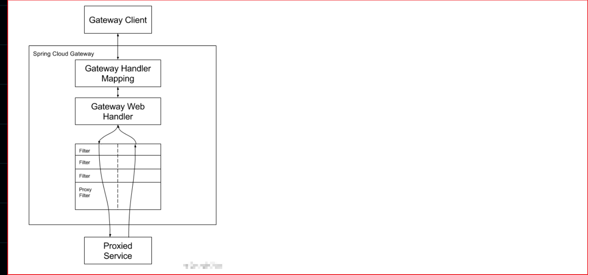

客户端向 Spring Cloud Gateway 发出请求。然后在 Gateway Handler Mapping 中找到与请求相匹配的路由，将其发送到 Gateway Web Handler。

Handler 再通过指定的过滤器链来将请求发送到我们实际的服务执行业务逻辑，然后返回。
过滤器之间用虚线分开是因为过滤器可能会在发送代理请求之前（“pre”）或之后（“post”）执行业务逻辑。

Filter在“pre”类型的过滤器可以做参数校验、权限校验、流量监控、日志输出、协议转换等，在“post”类型的过滤器中可以做响应内容、响应头的修改，日志的输出，流量监控等有着非常重要的作用。

#### 配置

##### yml配置

```yml
server:
  port: 9527

spring:
  application:
    name: cloud-gateway
  cloud:
    gateway:
      routes:
      - id: payment_routh #payment_route    #路由的ID，没有固定规则但要求唯一，建议配合服务名
        uri: http://localhost:8001          #匹配后提供服务的路由地址
        predicates:
        - Path=/payment/get/**         # 断言，路径相匹配的进行路由

      - id: payment_routh2 #payment_route    #路由的ID，没有固定规则但要求唯一，建议配合服务名
        uri: http://localhost:8001          #匹配后提供服务的路由地址
        predicates:
        - Path=/payment/lb/**         # 断言，路径相匹配的进行路由
```

##### java配置

```java
@Configuration
public class GateWayConfig {
    @Bean
    public RouteLocator customRouteLocator(RouteLocatorBuilder builder) {
        RouteLocatorBuilder.Builder routes = builder.routes();

        routes.route("path_route", r ->
                r.path("/payment/get/**").uri("http://localhost:8001")).build();

        return routes.build();
    }
}

```

#### Predicate（断言）

##### 作用

**如果请求与断言相匹配则进行路由，如果不匹配直接404**

##### After Route Predicate

就是通过设置一个时间，然后After代表的是后的意思，也就是设置的时间 `之后` 是可以访问这个路由的，在这个时间之前是访问不了的，注意：这个设置的是时区时间。

```yml
spring:
  cloud:
    gateway:
      discovery:
        locator:
          enabled: true #开启从注册中心动态创建路由的功能，利用微服务名进行路由
      routes:
        - id: payment_routh #payment_route    #路由的ID，没有固定规则但要求唯一，建议配合服务名
          # uri: http://localhost:8001          #匹配后提供服务的路由地址
          uri: lb://cloud-payment-service #匹配后提供服务的路由地址。
          predicates:
            - Path=/payment/get/**         # 断言，路径相匹配的进行路由
            - After=2022-08-20T00:10:15.434859+08:00[Asia/Shanghai]

```

设置了两个predicates（断言），**path**也算是一个，**After**又是一个。

##### Before Route Predicater

Before就是设置的时间之前可以访问，过了时间之后不可以访问

```yml
- Before=2020-02-05T15:10:03.685+08:00[Asia/Shanghai]
```

##### Between Route Predicate

两个时间的区间是可以访问的，过了时间之后不可以访问

```yml
- Between=2017-01-20T17:42:47.789-07:00[America/Denver], 2017-01-21T17:42:47.789-07:00[America/Denver]

```

##### Cookie Route Predicate

Cookie路由谓词工厂有两个参数，cookie和namea regexp（这是一个 Java 正则表达式）。此谓词匹配具有给定名称且其值与正则表达式匹配的 cookie。不带cookie访问直接404

```aql
- Cookie=username,zzyy
```

##### Header Route Predicater

Header路由谓词工厂有两个参数，the和headera regexp（这是一个 Java 正则表达式）。此谓词与具有给定名称且值与正则表达式匹配的标头匹配。

```yml
- Header=X-Request-Id, \d+
```

##### Host Route Predicate

路由谓词工厂采用Host一个参数：主机名列表patterns。该模式是一种 Ant 风格的模式，.以分隔符为分隔符。

```yml
- Host=**.baidu.com
```

```java
正确：curl http://localhost:9527/payment/lb -H “Host: www.baidu.com”
正确：curl http://localhost:9527/payment/lb -H “Host: java.baidu.com”
错误：curl http://localhost:9527/payment/lb -H “Host: java.baidu.net”
```

##### Method Route Predicate

设置了之后只有GET请求会路由

```yml
- Method=GET
```

##### Path Route Predicate

```yml
- Path=/payment/lb*/***
```

##### Query Route Predicate

支持传入两个参数，一个是属性名，一个为属性值，属性值可以是正则表达式。

```yml
- Query=username, \d+  # 要有参数名username并且值还要是整数才能路由
```

```java
//例如
http://localhost:9527/payment/lb?username=31
```

##### RemoteAddr Route Predicate

路由谓词工厂采用的RemoteAddr列表（最小大小为 1）sources，它们是 CIDR 表示法（IPv4 或 IPv6）字符串，例如192.168.0.1/16（其中192.168.0.1是 IP 地址和16子网掩码）。

```yml
- RemoteAddr=192.168.1.1/24
```

##### Weight Route Predicate

Weight路由谓词工厂有两个参数：和group（weight一个 int）。权重是按组计算的。以下示例配置权重路由谓词：

##### XForwarded Remote Addr Route Predicate

这可以与反向代理一起使用，例如负载平衡器或 Web 应用程序防火墙，其中仅当请求来自这些反向代理使用的受信任的 IP 地址列表时才允许请求

```yml
- XForwardedRemoteAddr=192.168.1.1/24
```

可以把它当做IF判断，当满足的时候才能路由到uri，否则直接报异常。

## redis

五种类型：string(字符串)、list([链表](https://baike.baidu.com/item/链表?fromModule=lemma_inlink))、set(集合)、zset(sorted set --有序集合)和hash（哈希类型）。

Spring Data Redis中提供了一个高度封装的类: RedisTemplate，针对jedis客户端中大量api进行了归类封装,将同一类型操作封装为operation接口，具体分类如下:

- ValueOperations:简单K-V操作
- SetOperations: set类型数据操作
- ZSetOperations: zset类型数据操作
- HashOperations:针对map类型的数据操作
- ListOperations:针对list类型的数据操作

### java连接redis

#### 导入pom 依赖 spring-boot-starter-data-redis

```html
<dependency>
    <groupId>org.springframework.boot</groupId>
    <artifactId>spring-boot-starter-data-redis</artifactId>
</dependency>
```

#### application.yml

```yaml
spring:
  #Redis相关配置
  redis:
    host: 192.168.17.128
    port: 6379
    #password: 123456
    database: 0 #操作的是0号数据库
    jedis:
      #Redis连接池配置
      pool:
        max-active: 8 #最大连接数
        max-wait: 1ms #连接池最大阻塞等待时间
        max-idle: 4 #连接池中的最大空闲连接
        min-idle: 0 #连接池中的最小空闲连接

```

#### test:

````java
    //注入RedisTemplate
    @Resource
    private RedisTemplate<String, String> redisTemplate;

     @Test
    public void redis() {
        redisTemplate.opsForValue().set("name", "lihua");
        String value = redisTemplate.opsForValue().get("name");
        System.out.println(value);
        redisTemplate.opsForValue().set("key1", "value1", 10L, TimeUnit.SECONDS);
        Boolean aBoolean = redisTemplate.opsForValue().setIfAbsent("name", "lihua");
        System.out.println(aBoolean);
    }
````

#### RedisTemplate配置

```java
/**
 * RedisTemplate 配置
 *
 * @author: liang_zh
 * @since: 2022-12-10 16:57
 */
@Configuration
@EnableCaching
public class RedisConfig {

    /**
     * 定义第三方的Bean
     * 方法设置为公有的，要把哪个对象装配到容器当中，那么就返回这个对象，这边返回的RedisTemplate
     * 用Template访问数据库，Template要有访问数据库的能力，那他就得能够创建连接，连接由连接工厂创建，所以就要把连接工厂
     * 工厂放进来，注入给Template，他才能访问数据库(RedisConnectionFactory factory)就是声明连接工厂
     *
     * @param factory 工厂
     * @return {@link RedisTemplate}<{@link String}, {@link Object}>
     */
    @Bean
    public RedisTemplate<String, Object> redisTemplate(RedisConnectionFactory factory) {
        //实例化这个Bean
        RedisTemplate<String, Object> template = new RedisTemplate<>();
        //把工厂设置给Template
        template.setConnectionFactory(factory);
        //配置Template主要配置序列化的方式，因为写的是java程序，得到的是java类型的数据，最终要这个数据存储到数据库里面
        //就要指定一种序列化的方式，或者说数据转换的方式
        //设置key的序列化方式
        template.setKeySerializer(RedisSerializer.string());
        //设置value的序列化方式
        template.setValueSerializer(RedisSerializer.json());
        //设置hash的key的序列化方式
        template.setHashKeySerializer(RedisSerializer.string());
        //设置hash的value的序列化方式
        template.setHashValueSerializer(RedisSerializer.json());
        //使上面参数生效
        template.afterPropertiesSet();
        return template;
    }
}
```


## 设计模式

总体来说设计模式分为三大类：

- 创建型模式，共**五**种：工厂方法模式、抽象工厂模式、单例模式、建造者模式、原型模式。


- 结构型模式，共**七**种：适配器模式、装饰器模式、代理模式、外观模式、桥接模式、组合模式、享元模式。


- 行为型模式，共**十一**种：策略模式、模板方法模式、观察者模式、迭代子模式、责任链模式、命令模式、备忘录模式、状态模式、访问者模式、中介者模式、解释器模式。

## ajax

ajax=Asynchronous JavaSciript and XML（异步Javascript和xml）