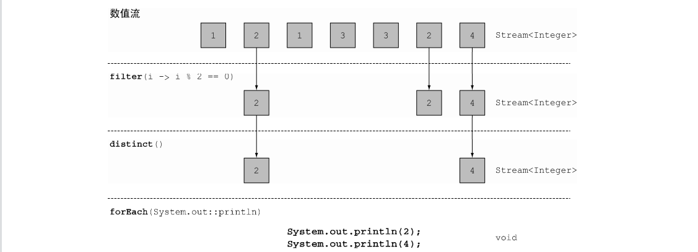
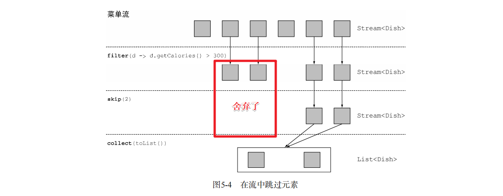

# 总结

## 一：数据结构篇

### 线性表：

线性表是一种线性结构，它是由零个或多个数据元素构成的**有限序列**。线性表的特征是在一个序列中，除了头尾元素，每个元素都有且只有一个直接前驱，有且只有一个直接后继，而序列头元素没有直接前驱，序列尾元素没有直接后继。

数据结构中常见的线性结构有数组、单链表、双链表、循环链表等。线性表中的元素为某种**相同**的抽象数据类型。可以是C语言的内置类型或结构体，也可以是C++自定义类型。

### 数组

数组在实际的物理内存上也是连续存储的，数组有**上界**和**下界**。C语言中定义一个数组：


数组下标是从0开始的，a[0]对应第一个元素。其中，a[0]称为数组a的下界，a[6]称为数组a的上届。超过这个范围的下标使用数组，将造成**数组越界错误**。
数组的特点是：**数据连续，支持快速随机访问。**
数组分为固定数组与动态数组。其中固定数组的大小必须在编译时就能够确认，动态数组允许在运行时申请数组内存。复杂点的数组是多维数组，多维数组实际上也是通过一维数组来实现的。

### 单向链表

单向链表是链表的一种。链表由节点所构成，节点内含一个指向下一个节点的指针，节点依次链接成为链表。因此，链表这种数据结构通常在物理内存上是不连续的。链表的通常含有一个头节点，头节点不存放实际的值，它含有一个指针，指向存放元素的第一个节点。

```java
class Node():    
 单链表中的节点应该具有两个属性：val 和 next。    val 是当前节点的值，    next 是指向下一个节点的指针/引用。     `

` def __init__(self, value):   # 存放元素数据  self.val = value   # next是下一个节点的标识  self.next = None`
```


#### 设计链表的实现

您可以选择使用单链表或双链表。单链表中的节点应该具有两个属性：`val` 和 `next`。`val` 是当前节点的值，`next` 是指向下一个节点的指针/引用。如果要使用双向链表，则还需要一个属性 `prev` 以指示链表中的上一个节点。假设链表中的所有节点都是 0-index 的。

在链表类中实现这些功能：

- get(index)：获取链表中第 `index` 个节点的值。如果索引无效，则返回`-1`。

- addAtHead(val)：在链表的第一个元素之前添加一个值为 `val` 的节点。插入后，新节点将成为链表的第一个节点。

- addAtTail(val)：将值为 `val` 的节点追加到链表的最后一个元素。

- addAtIndex(index,val)：在链表中的第 `index` 个节点之前添加值为 `val` 的节点。如果 `index` 等于链表的长度，则该节点将附加到链表的末尾。如果 `index` 大于链表长度，则不会插入节点。

- deleteAtIndex(index)：如果索引 `index` 有效，则删除链表中的第 `index` 个节点

  

  

#### 链表与顺序表的对比

链表失去了顺序表随机读取的优点，同时链表由于增加了结点的指针域，空间开销比较大，但对存储空间的使用要相对灵活。

链表与顺序表的各种操作复杂度如下所示：

| 操作            | 链表 | 顺序表 |
| --------------- | ---- | ------ |
| 访问元素        | O(n) | O(1)   |
| 在头部插入/删除 | O(1) | O(n)   |
| 在尾部插入/删除 | O(n) | O(1)   |
| 在中间插入/删除 | O(n) | O(n)   |


## 二：算法篇

## 三：java代码篇

### 一：Java8

#### 流（Stream）

流是一系列数据项，一次只生成一项。程序可以从输入流中一个一个读取数据项，然后以同样的方式将数据项写入输出流。一个程序的输出流很可能是另一个程序的输入流。思路变成了把这样的流变成那样的流（就像写数据库查询语句时的那种思路），而不是一次只处理一个项目。另一个好处是，Java 8可以透明地把输入的不相关部分拿到几个CPU内核上去分别执行你的 Stream操作流水线——这是几乎免费的并行，用不着去费劲搞Thread了。

#### 操作

+ filter——接受Lambda，从流中排除某些元素。在本例中，通过传递lambda d -> d.getCalories() > 300，选择出热量超过300卡路里的菜肴。
+ map——接受一个Lambda，将元素转换成其他形式或提取信息。在本例中，通过传递方法引用Dish::getName，相当于Lambda d -> d.getName()，提取了每道菜的菜名。
+ limit——截断流，使其元素不超过给定数量。

collect——将流转换为其他形式。在本例中，流被转换为一个列表。它看起来有点儿像变魔术，我们在第6章中会详细解释collect的工作原理。现在，你可以把collect看作能够接受各种方案作为参数，并将流中的元素累积成为一个汇总结果的操作。这里的toList()就是将流转换为列表的方案。

+  一个数据源（如集合）来执行一个查询；
+  一个中间操作链，形成一条流的流水线；
+  一个终端操作，执行流水线，并能生成结果。

##### 中间操作


##### 终端操作


##### 用谓词筛选

Streams接口支持filter方法。该操作会接受一个谓词（一个返回boolean的函数）作为参数，并返回一个包括所有符合谓词的元素的流。


##### 筛选和切片

###### 筛选各异的元素

流还支持一个叫作distinct的方法，它会返回一个元素各异（根据流所生成元素的hashCode和equals方法实现）的流。

```java
List<Integer> numbers = Arrays.asList(1, 2, 1, 3, 3, 2, 4); 
numbers.stream()  .filter(i -> i % 2 == 0) .distinct().forEach(System.out::println);
```



###### 截短流

流支持limit(n)方法，该方法会返回一个不超过给定长度的流。所需的长度作为参数传递给limit。如果流是有序的，则最多会返回前n个元素。(请注意limit也可以用在无序流上，比如源是一个Set。这种情况下，limit的结果不会以任何顺序排列。)

```java
List<Dish> dishes = menu.stream() 
 .filter(d -> d.getCalories() > 300) 
 .limit(3) 
 .collect(toList());
```


###### 跳过元素

流还支持skip(n)方法，返回一个扔掉了前n个元素的流。如果流中元素不足n个，则返回一个空流。请注意，limit(n)和skip(n)是互补的！

```java
List<Dish> dishes = menu.stream() 
 .filter(d -> d.getCalories() > 300) 
 .skip(2) 
 .collect(toList());
```



##### 映射

###### 对流中每一个元素应用函数

流支持map方法，它会接受一个函数作为参数。这个函数会被应用到每个元素上，并将其映射成一个新的元素（使用映射一词，是因为它和转换类似，但其中的细微差别在于它是“创建一个新版本”而不是去“修改”）。

```java
List<String> dishNames = menu.stream() 
 .map(Dish::getName) 
 .collect(toList());
```

eg：现在让我们回到提取菜名的例子。如果你要找出每道菜的名称有多长，怎么做？你可以像下面这样，再链接上一个map。

```java
List<Integer> dishNameLengths = menu.stream() 
 .map(Dish::getName) 
 .map(String::length) 
 .collect(toList());
```

###### 流的扁平化

使用flatMap方法的效果是，各个数组并不是分别映射成一个流，而是映射成流的内容。所有使用map(Arrays::stream)时生成的单个流都被合并起来，即扁平化为一个流。

```java
List<String> uniqueCharacters = words.stream() 
 .map(w -> w.split("")) 
 .flatMap(Arrays::stream) 
 .distinct() 
 .collect(Collectors.toList());
```


一言以蔽之，flatmap方法让你把一个流中的每个值都换成另一个流，然后把所有的流连接起来成为一个流。

###### 测验 映射

```java
(1) 给定一个数字列表，如何返回一个由每个数的平方构成的列表呢？例如，给定[1, 2, 3, 4, 5]，应该返回[1, 4, 9, 16, 25]。

答案：你可以利用map方法的Lambda，接受一个数字，并返回该数字平方的Lambda来解决这个问题。

List<Integer> numbers = Arrays.asList(1, 2, 3, 4, 5); 

List<Integer> squares = numbers.stream() .map(n -> n \* n) .collect(toList()); 

(2) 给定两个数字列表，如何返回所有的数对呢？例如，给定列表[1, 2, 3]和列表[3, 4]，应
该返回[(1, 3), (1, 4), (2, 3), (2, 4), (3, 3), (3, 4)]。为简单起见，你可以用有两个元素的数组来代表数对。 

答案：你可以使用两个map来迭代这两个列表，并生成数对。但这样会返回一个Stream- <Stream<Integer[]>>。你需要让生成的流扁平化，以得到一个Stream<Integer[]>。这正是flatMap所做的：

List<Integer> numbers1 = Arrays.asList(1, 2, 3); 

List<Integer> numbers2 = Arrays.asList(3, 4); 

List<int[]> pairs = numbers1.stream() .flatMap(i -> numbers2.stream().map(j -> new int[]{i, j})).collect(toList()); 

(3) 如何扩展前一个例子，只返回总和能被3整除的数对呢？例如(2, 4)和(3, 3)是可以的。

答案：你在前面看到了，filter可以配合谓词使用来筛选流中的元素。因为在flatMap操作后，你有了一个代表数对的int[]流，所以你只需要一个谓词来检查总和是否能被3整除就可以了：

List<Integer> numbers1 = Arrays.asList(1, 2, 3); 

List<Integer> numbers2 = Arrays.asList(3, 4); 

List<int[]> pairs =  numbers1.stream() 

 .flatMap(i -> numbers2.stream() 

 .filter(j -> (i + j) % 3 == 0) 

 .map(j -> new int[]{i, j}) 

 ) 
 .collect(toList()); 

其结果是[(2, 4), (3, 3)]。

```

##### 查找和匹配

另一个常见的数据处理套路是看看数据集中的某些元素是否匹配一个给定的属性。Stream API通过allMatch、anyMatch、noneMatch、findFirst和findAny方法提供了这样的工具

###### 检查谓词是否至少匹配一个元素

anyMatch方法可以回答“流中是否有一个元素能匹配给定的谓词”。比如，你可以用它来看看菜单里面是否有素食可选择：

```java
if(menu.stream().anyMatch(Dish::isVegetarian)){ 
 System.out.println("The menu is (somewhat) vegetarian friendly!!"); 
} 
```

anyMatch方法返回一个boolean，因此是一个终端操作。

###### 检查谓词是否匹配所有元素

allMatch方法的工作原理和anyMatch类似，但它会看看流中的元素是否都能匹配给定的谓词

```java
boolean isHealthy = menu.stream() .allMatch(d -> d.getCalories() < 1000);
```

###### noneMatch

和allMatch相对的是noneMatch。它可以确保流中没有任何元素与给定的谓词匹配

```java
boolean isHealthy = menu.stream() .noneMatch(d -> d.getCalories() >= 1000);
```

anyMatch、allMatch和noneMatch这三个操作都用到了我们所谓的短路，这就是大家熟悉的Java中&&和||运算符短路在流中的版本

##### 短路求值

有些操作不需要处理整个流就能得到结果。例如，假设你需要对一个用and连起来的大布尔表达式求值。不管表达式有多长，你只需找到一个表达式为false，就可以推断整个表达式将返回false，所以用不着计算整个表达式。这就是**短路**。对于流而言，某些操作（例如allMatch、anyMatch、noneMatch、findFirst和findAny）不用处理整个流就能得到结果。只要找到一个元素，就可以有结果了。同样，limit也是一个短路操作：它只需要创建一个给定大小的流，而用不着处理流中所有的元素。在碰到无限大小的流的时候，这种操作就有用了：它们可以把无限流变成有限流。

###### 查找元素

findAny方法将返回当前流中的任意元素。它可以与其他流操作结合使用

```java
Optional<Dish> dish =  menu.stream() .filter(Dish::isVegetarian) .findAny(); 
```

流水线将在后台进行优化使其只需走一遍，并在利用短路找到结果时立即结束

###### 查找第一个元素

有些流有一个出现顺序（encounter order）来指定流中项目出现的逻辑顺序（比如由List或排序好的数据列生成的流）。对于这种流，你可能想要找到第一个元素。为此有一个findFirst方法，它的工作方式类似于findany。

```java
List<Integer> someNumbers = Arrays.asList(1, 2, 3, 4, 5); 
Optional<Integer> firstSquareDivisibleByThree = someNumbers.stream() .map(x -> x * x) 
 .filter(x -> x % 3 == 0) 
 .findFirst(); // 9
```

###### 何时使用**findFirst**和**findAny**?

你可能会想，为什么会同时有findFirst和findAny呢？答案是并行。找到第一个元素在并行上限制更多。如果你不关心返回的元素是哪个，请使用findAny，因为它在使用并行流时限制较少。

##### 归约

###### 元素求和

```java
int sum = numbers.stream().reduce(0, (a, b) -> a + b); 
```

无初始值 reduce还有一个重载的变体，它不接受初始值，但是会返回一个Optional对象：

```java
Optional<Integer> sum = numbers.stream().reduce((a, b) -> (a + b));
```


##### 数值流

###### 原始类型流特化

Java 8引入了三个原始类型特化流接口来解决这个问题：IntStream、DoubleStream和 LongStream，分别将流中的元素特化为int、long和double，从而避免了暗含的装箱成本。每 个接口都带来了进行常用数值归约的新方法，比如对数值流求和的sum，找到最大元素的max。 此外还有在必要时再把它们转换回对象流的方法。要记住的是，这些特化的原因并不在于流的复杂性，而是装箱造成的复杂性——即类似int和Integer之间的效率差异。

映射到数值流

将流转换为特化版本的常用方法是mapToInt、mapToDouble和mapToLong。这些方法和前 面说的map方法的工作方式一样，只是它们返回的是一个特化流，而不是Stream。

```java
int calories = menu.stream() .mapToInt(Dish::getCalories) .sum();
```

##### flatMap

使用flatMap方法的效果是，各个数组并不是分别映射成一个流，而是映射成流的内容


例如：给定两个数字列表，如何返回所有的数对呢？例如，给定列表[1, 2, 3]和列表[3, 4]，应 该返回[(1, 3), (1, 4), (2, 3), (2, 4), (3, 3), (3, 4)]。为简单起见，你可以用有两个元素的数组来代 表数对。

答：使用两个map来迭代这两个列表，并生成数对。但这样会返回一个Stream- <Stream<Integer[]>>。你需要让生成的流扁平化，以得到一个Stream<Integer[]>。这正是flatMap所做的： 

```java
List<Integer> numbers1 = Arrays.asList(1, 2, 3); 
List<Integer> numbers2 = Arrays.asList(3, 4); 
List<int[]> pairs = 
 numbers1.stream() 
 .flatMap(i -> numbers2.stream() 
 .map(j -> new int[]{i, j}))
 .collect(toList()); 
```


#### 小结

+  流是“从支持数据处理操作的源生成的一系列元素”。
+  流利用内部迭代：迭代通过filter、map、sorted等操作被抽象掉了。
+  流操作有两类：**中间操作**和**终端操作**。
+  filter和map等中间操作会返回一个流，并可以链接在一起。可以用它们来设置一条流水线，但并不会生成任何结果。
+  forEach和count等终端操作会返回一个非流的值，并处理流水线以返回结果。
+  流中的元素是按需计算的。

### 二：杂记

#### 注解篇

##### @NotNull&&@NotBlank&&@NotEmpty

- @**NotNull**适用于基本数据类型(**Integer**，**Long**，**Double**等等)，当 @NotNull 注解被使用在 String 类型的数据上，则表示该数据不能为 Null（但是可以为 Empty）
- @**NotBlank**适用于 **String** 类型的数据上，加了@NotBlank 注解的参数不能为 Null 且 **trim()** 之后 **size > 0**
- @**NotEmpty**适用于 String、**Collection**集合、Map、数组等等，加了@NotEmpty 注解的参数不能为 Null 或者 长度为 0

## 四：Git篇

### Git 操作

- git init   初始化；

- git branch git查看分支**名称**；

- git remote add origin git 远程代码仓库地址 ， 与远程git代码仓库建立**连接**，

- git fetch origin 分支名称 （更新分支最新状态）**切换分支拉取代码** ；

- git checkout -b 分支名称 默认拉取的分支为master主分支，需要用命令来对**分支进行切换**；

- git pull origin 分支名称；**拉取**代码与线下的git代码合并；

-  git push -u origin dev-2.0.1 最后合并完后将代码**push**到git上；

- **生成SSH** ssh-keygen -t rsa -C '402542336@qq.com' -f ~/.ssh/gitee_id_rsa；

- git config credential.helper store 执行完 第一次要输入账号密码，以后就不用了。不加参数： --**global** 只对这个仓库生效，并非全局设置 。

## 五:  Linux

### 常用命令

- ifconfig -a  **查看ip地址**
- tar  -zxvf  jdk-8u311-linux-i586.tar.gz  ***#对压缩包解压***
- tail -f app.log　　动态查看日志(默认最后10行，相当于增加参数 -n 10)
-  tail -200f app.log (最后200行，某一时刻往前推)  ； tail -n 20 app.log(显示app.log**最后20**行)tail -n +5 app.log　　(从**第5行**开始显示文件)
- cat -n filename |grep "**关键字**"
- cat app.log | grep -C 5 '关键字' 　　(显示日志里匹配字串那行以及**前后5行**)；cat app.log | grep -B 5 '关键字' (显示匹配字串及**前5行**)；cat app.log | grep -A 5 '关键字' 　　(显示匹配字串及**后5行**)


### 安装mysql

wget -i -c http://dev.mysql.com/get/mysql57-community-release-el7-10.noarch.rpm 下载mysql包

安装mysql包`

```sql
yum -y install mysql57-community-release-el7-10.noarch.rpm 
```


```
yum -y install mysql-community-server 安装mysql 
```


遇见的错误

```
*yum -y install mysql-community-server --nogpgcheck*  需要禁掉GPG验证检查
```


```sql
service mysqld status查看mysql运行状态
```


```sql
grep ‘password’ /var/log/mysqld.log 查看mysql密码
```


```sql
mysql -u root -p 进入mysql
```


```js
stop mysqld.service 关闭服务
```


```js
vim /etc/my.cnf
```


```js
输入i  加入skip-grant-tables  然后esc  ：wq保存退出
```


```
service mysqld start 重启mysql 服务
```


```sql
show databases；
```


3.安装jdk

```sql
yum install -y java-1.8.0-openjdk.x86_64 下载jdk 
```


```sql
java -version  查看版本
```


### 安装nacos

下载nacos

```sql
[wget](https://so.csdn.net/so/search?q=wget&spm=1001.2101.3001.7020) https://github.com/alibaba/nacos/releases/download/1.2.0/nacos-server-1.2.0.tar.gz
```


tar -xvf nacos-server-1.2.0.tar.gz 解压nacos


**启动命令**

```mssql
sh startup.sh -m standalone
```

### 安装docker

安装一组工具

```
sudo yum install -y yum-utils 
```

设置 yum 仓库地址

```
sudo yum-config-manager \
    --add-repo \
    https://download.docker.com/linux/centos/docker-ce.repo
sudo yum-config-manager \
     --add-repo \
     http://mirrors.aliyun.com/docker-ce/linux/centos/docker-ce.repo
```

更新 yum 缓存

```
sudo yum makecache fast #yum 是包管理器
```

安装新版 docker

```
sudo yum install -y docker-ce docker-ce-cli containerd.io
```

 启动docker

```
 systemctl start docker
```

 查看状态

```
systemctl status docker
```

启动

```
# 设置开机自启
systemctl enable docker
# 禁用开机自启
systemctl disable docker
# 重启
systemctl restart docker
```

#### docker操作

```
1.语法：docker pull 镜像名
拉取docker镜像
docker pull hello-world

2.浏览镜像文件
语法：docker images

3.查看镜像详情
语法：docker inspect 镜像名或镜像id
EG:docker inspect hello-world

4.导出镜像文件
镜像导出(linux系统中的镜像文件下载到本地-例如window)，导出后给他人使用
语法：docker save hello-world | gzip >（这里填写要导出的镜像名）.tar.gz
EG:docker save  hello-world | gzip > hello-world.tar.gz

5.删除镜像文件
语法：docker image rm 镜像名或镜像id
EG:docker image rm hello-world

6.导入镜像操作
镜像导入（要在hello-world.tar.gz 文件所在目录下执行这个命令）*注意*这里的hello-world.tar.gz 文件是我们要导入的镜像，这里以hello-world.tar.gz 文件为例。
EG:docker load < hello-world.tar.gz  

7.运行镜像文件
基于镜像，启动容器运行。
语法：docker run 镜像名
EG:docker run hello-world

8.查看Docker中的容器
docker ps

9.查看docker运行中的所有容器
docker ps -a

10.查看容器日志(logs)信息
docker container logs 802  #802为自己的容器id（一般写前三位即可）

11.停止(stop)或重启(Restart)容器(Container)
docker container stop 802  #802为容器自己的id
docker container restart 802 #802位容器自己的id

12.进入(exec)指定容器(Container)
docker exec -it 802 bash #802为容器id

13.从容器(Container)中退出(exit)
exit

14.删除(rm)容器(Container)
docker container rm 802 #802为容器id
docker container rm -f 802 #802为容器id(强制删除)

15.清理所有处于终止状态容器
docker container prune
```

### 安装redis

```
# 拉取redis
docker pull redis
```

### 防火墙

```java
# 关闭防火墙
systemctl stop firewalld
    
# 启动防火墙
systemctl start firewalld
    
# 禁止开机启动防火墙
systemctl disable firewalld
    
# 设置开机启用防火墙
systemctl enable firewalld.service
    
#查看是否关闭防火墙
systemctl status firewalld
```

## 六：mysql

### sql语句

#### 修改字段名

```
mysql修改字段名：
ALTER  TABLE 表名 CHANGE [column] 旧字段名 新字段名 新数据类型; 
```

#### 修改表名

```sql
在mysql中可以使用【alter table 旧表名 rename 新表名;】语句修改表名，如
【mysql> alter table user rename user2;】
```

#### 修改某一列的类型

```sql
alter table 表名 modify 列名 类型;
mysql> alter table type modify type_name varchar(100) default null comment '';
```

#### 增加一列

```sql
alter table 表名 add 列名 类型;
mysql> alter table type add age int(11) default null comment '';
```

#### 删除一列

```sql
用法：alter table type drop 列名;
mysql> alter table type drop age default null comment '';
```

## 七：SpringCloud

### gateway

#### 三大核心概念

- Route（路由）：路由是构建网关的基本模块，它由ID，目标URI，一系列的断言和过滤器组成，如果断言为true则匹配该路由。

- Predicate（断言）：参考的是Java8的java.util.function.Predicate，开发人员可以匹配HTTP请求中的所有内容(例如请求头或请求参数)，如果请求与断言相匹配则进行路由。

- Filter（过滤）：指的是Spring框架中GatewayFilter的实例，使用过滤器，可以在请求被路由前或者之后对请求进行修改。

#### 作用

- 反向代理
- 鉴权
- 限流
- 熔断
- 日志监控

#### 工作流程

**核心逻辑：路由转发+执行过滤器链**


客户端向 Spring Cloud Gateway 发出请求。然后在 Gateway Handler Mapping 中找到与请求相匹配的路由，将其发送到 Gateway Web Handler。

Handler 再通过指定的过滤器链来将请求发送到我们实际的服务执行业务逻辑，然后返回。
过滤器之间用虚线分开是因为过滤器可能会在发送代理请求之前（“pre”）或之后（“post”）执行业务逻辑。

Filter在“pre”类型的过滤器可以做参数校验、权限校验、流量监控、日志输出、协议转换等，在“post”类型的过滤器中可以做响应内容、响应头的修改，日志的输出，流量监控等有着非常重要的作用。

#### 配置

##### yml配置

```yml
server:
  port: 9527

spring:
  application:
    name: cloud-gateway
  cloud:
    gateway:
      routes:
      - id: payment_routh #payment_route    #路由的ID，没有固定规则但要求唯一，建议配合服务名
        uri: http://localhost:8001          #匹配后提供服务的路由地址
        predicates:
        - Path=/payment/get/**         # 断言，路径相匹配的进行路由

      - id: payment_routh2 #payment_route    #路由的ID，没有固定规则但要求唯一，建议配合服务名
        uri: http://localhost:8001          #匹配后提供服务的路由地址
        predicates:
        - Path=/payment/lb/**         # 断言，路径相匹配的进行路由
```

##### java配置

```java
@Configuration
public class GateWayConfig {
    @Bean
    public RouteLocator customRouteLocator(RouteLocatorBuilder builder) {
        RouteLocatorBuilder.Builder routes = builder.routes();

        routes.route("path_route", r ->
                r.path("/payment/get/**").uri("http://localhost:8001")).build();

        return routes.build();
    }
}

```

#### Predicate（断言）

##### 作用

**如果请求与断言相匹配则进行路由，如果不匹配直接404**

##### After Route Predicate

就是通过设置一个时间，然后After代表的是后的意思，也就是设置的时间 `之后` 是可以访问这个路由的，在这个时间之前是访问不了的，注意：这个设置的是时区时间。

```yml
spring:
  cloud:
    gateway:
      discovery:
        locator:
          enabled: true #开启从注册中心动态创建路由的功能，利用微服务名进行路由
      routes:
        - id: payment_routh #payment_route    #路由的ID，没有固定规则但要求唯一，建议配合服务名
          # uri: http://localhost:8001          #匹配后提供服务的路由地址
          uri: lb://cloud-payment-service #匹配后提供服务的路由地址
          predicates:
            - Path=/payment/get/**         # 断言，路径相匹配的进行路由
            - After=2022-08-20T00:10:15.434859+08:00[Asia/Shanghai]

```

设置了两个predicates（断言），**path**也算是一个，**After**又是一个。

##### Before Route Predicater

Before就是设置的时间之前可以访问，过了时间之后不可以访问

```yml
- Before=2020-02-05T15:10:03.685+08:00[Asia/Shanghai]
```

##### Between Route Predicate

两个时间的区间是可以访问的，过了时间之后不可以访问

```yml
- Between=2017-01-20T17:42:47.789-07:00[America/Denver], 2017-01-21T17:42:47.789-07:00[America/Denver]

```

##### Cookie Route Predicate

Cookie路由谓词工厂有两个参数，cookie和namea regexp（这是一个 Java 正则表达式）。此谓词匹配具有给定名称且其值与正则表达式匹配的 cookie。不带cookie访问直接404

```aql
- Cookie=username,zzyy
```

##### Header Route Predicater

Header路由谓词工厂有两个参数，the和headera regexp（这是一个 Java 正则表达式）。此谓词与具有给定名称且值与正则表达式匹配的标头匹配。

```yml
- Header=X-Request-Id, \d+
```

##### Host Route Predicate

路由谓词工厂采用Host一个参数：主机名列表patterns。该模式是一种 Ant 风格的模式，.以分隔符为分隔符。

```yml
- Host=**.baidu.com
```

```java
正确：curl http://localhost:9527/payment/lb -H “Host: www.baidu.com”
正确：curl http://localhost:9527/payment/lb -H “Host: java.baidu.com”
错误：curl http://localhost:9527/payment/lb -H “Host: java.baidu.net”
```

##### Method Route Predicate

设置了之后只有GET请求会路由

```yml
- Method=GET
```

##### Path Route Predicate

```yml
- Path=/payment/lb*/***
```

##### Query Route Predicate

支持传入两个参数，一个是属性名，一个为属性值，属性值可以是正则表达式。

```yml
- Query=username, \d+  # 要有参数名username并且值还要是整数才能路由
```

```java
//例如
http://localhost:9527/payment/lb?username=31
```

##### RemoteAddr Route Predicate

路由谓词工厂采用的RemoteAddr列表（最小大小为 1）sources，它们是 CIDR 表示法（IPv4 或 IPv6）字符串，例如192.168.0.1/16（其中192.168.0.1是 IP 地址和16子网掩码）。

```yml
- RemoteAddr=192.168.1.1/24
```

##### Weight Route Predicate

Weight路由谓词工厂有两个参数：和group（weight一个 int）。权重是按组计算的。以下示例配置权重路由谓词：

##### XForwarded Remote Addr Route Predicate

这可以与反向代理一起使用，例如负载平衡器或 Web 应用程序防火墙，其中仅当请求来自这些反向代理使用的受信任的 IP 地址列表时才允许请求

```yml
- XForwardedRemoteAddr=192.168.1.1/24
```

可以把它当做IF判断，当满足的时候才能路由到uri，否则直接报异常。

## redis

五种类型：string(字符串)、list([链表](https://baike.baidu.com/item/链表?fromModule=lemma_inlink))、set(集合)、zset(sorted set --有序集合)和hash（哈希类型）